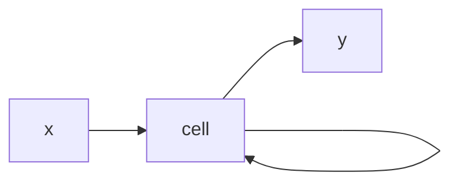
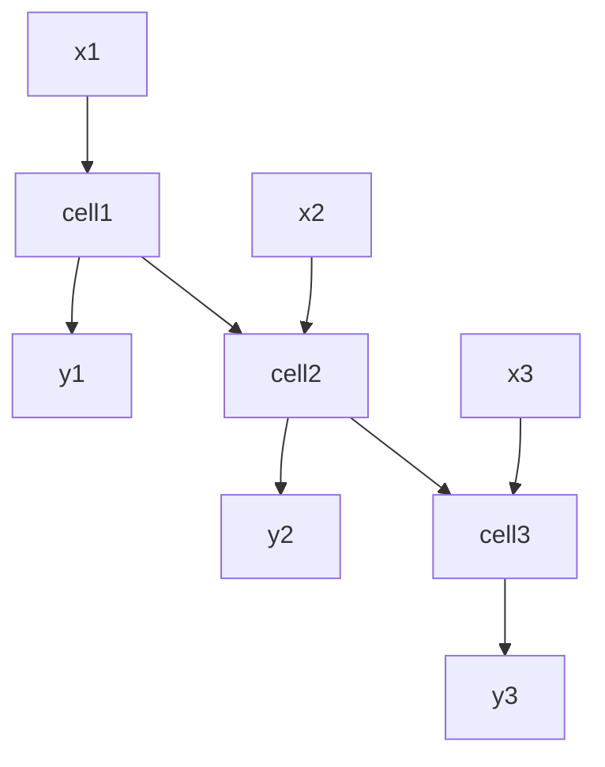

# RNN(Recurrent Neural Network)
- 입력과 출력을 시퀀스 단위로 처리하는 시퀀스 모델
	- LSTM,  GRU 등이 RNN 에 속함
- Feed Forward Neural Network이 아닌 신경망 중 하나

- RNN에서 은닉층에서 활성화 함수를 통해 결과를 내보내는 역할을 하는 노드를 셀이라고 함
- 셀은 이전 값을 기억하려고 하는 메모리 역할을 함

- 실제로는 다음과 같은 형태로 구성
