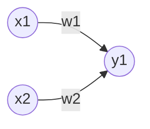

## 퍼셉트론(Perceptron)
- 다수의 신호를 입력받아 하나의 신호를 출력



- 2개의 신호를 입력받은 퍼셉트론의 예
- 각 원은 **뉴런** 또는 **노드**
- 각 뉴런에 보내질 때 고유한 **가중치**가 곱해짐
- 뉴런에서 온 신호의 총합이 특정 한계를 넘어설 때만 1을 출력하고, 한계를 **임계값**이라 부름

$$
y = \begin{cases}
    0(w_1x_1 +w_2x_2 \le \theta)\\
    1(w_1x_1 +w_2x_2 \gt \theta)
\end{cases}
$$

## 단순한 논리회로
- 퍼셉트론을 활용하는 다양한 방법이 있지만, 단순한 논리회로로 구현 가능

### AND 게이트

|$x_1$|$x_1$|$y$|
|:-:|:-:|:-:|
|0|0|0|
|1|0|0|
|0|1|0|
|1|1|1|

### NAND 게이트
- Not AND

|$x_1$|$x_1$|$y$|
|:-:|:-:|:-:|
|0|0|1|
|1|0|1|
|0|1|1|
|1|1|0|

### OR 게이트

|$x_1$|$x_1$|$y$|
|:-:|:-:|:-:|
|0|0|0|
|1|0|1|
|0|1|1|
|1|1|1|

## 퍼셉트론 구현
```python
# AND 게이트 구현
import numpy as np

def AND(x1, x2):
    x = np.array([x1, x2])
    w = np.array([0.5, 0.5])
    b = -0.7
    tmp = np.sum(w * x) + b
    if tmp <= 0:
        return 0
    else:
        return 1
```

## 퍼셉트론 한계
$(0, 0), (1, 1)$과 $(1, 0), (0, 1)$를 직선으로 구분하는 방법이 없음
- 만약 선형성 제약이 없으면 해결하는 방법을 만들 수 있음