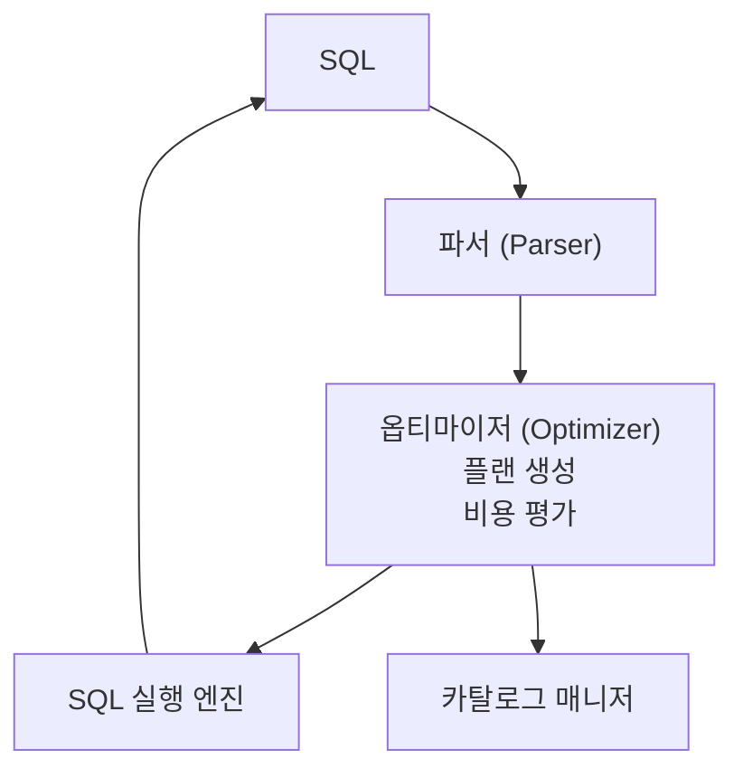
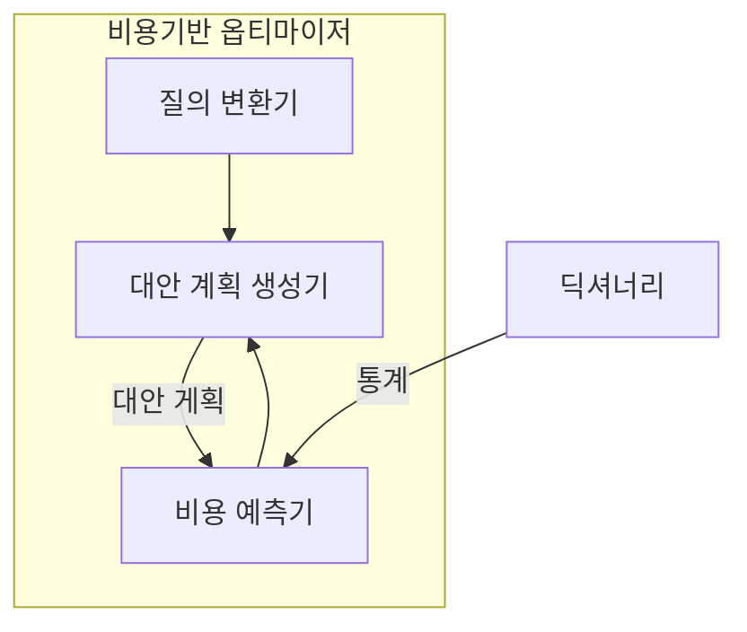

## 옵티마이저(Optimizer)
DB에서 주어진 질의에 대해 최소 비용으로 실행 계획을 수립, SQL을 실행하는 기능
SQL을 가장 빠르고 효율적으로 수행할 최적의 처리 경로를 생성해주는 DBMS의 핵심 엔진

## 실행 계획(Execution Plan)
동일한 결과가 나오는 SQL이라도, 어떻게 실행하는지에 따라 성능이 달라질 수 있음
데이터 딕셔너리에 있는 오브젝트 통계, 시스템 통계 등의 정보를 사용해서 예상되는 비용을 평가, 실행 계획을 작성
옵티마이저는 이런 비용을 계산하고, 가장 낮은 비용을 가진 실행 계획을 선택

#### 쿼리 처리 흐름

SQL문을 작성 및 실행하면, 파서(Parser)가 SQL문 문법 검사 및 구문 분석
옵티마이저는 여러 플랜을 생성, 카탈로그 매니저에 있는 각종 통계정보를 기반으로 비용을 평가, 최소 비용의 실행 계획 결정

## 규칙 기반 옵티마이저(RBO, Rule Based Optimizer)
규칙(우선 순위)를 가지고 실행계획을 생성
- [ORACLE RBO](https://docs.oracle.com/cd/B10501_01/server.920/a96533/rbo.htm)
- RBO 장점

기능이 한정적이고 쉽움
규칙에 따라 튜닝이 간단함
운영중 SQL 실행 계획이 거의 변하는 일이 없어, 앤세스 패스가 변경되어 성능이 떨어지는 장애 발생하지 않음

- RBO 단점
데이터 변동을 따라가지 못함
SQL문 작성시 항목순서, 인덱스 만드는 순서가 중요하기 때문에, 코드 수정, 인덱스 관리의 문제가 원인이 되어 성능에 영향을 끼치기도 함

## 비용 기반 옵티마이저(CBO, Cost Based Optimizer)
규칙 만으로 현실의 모든 사항을 예측할 수 없음
SQL문을 처리하는데 필요한 비용이 가장 적은 실행 계획을 선택하는 방식으로, 테이블, 인덱스, 칼럼 등 다양한 객체 정보와 통계정보, 시스템 통계정보 등을 이용하여 예측

질의 변환기, 대안 계획 생성기, 비용 예측기 등으로 구성
- 질의 변환기 : SQL문을 처리하기 더욱 용의한 형태로 변환
- 대안 계획 생성기 : 동일한 결과를 생성하는 다양한 대안 계획 생성 모듈
- 비용 예측기 : 대안 계획 생성기에 의해 생성된 대안 계획의 비용 예측 모듈
