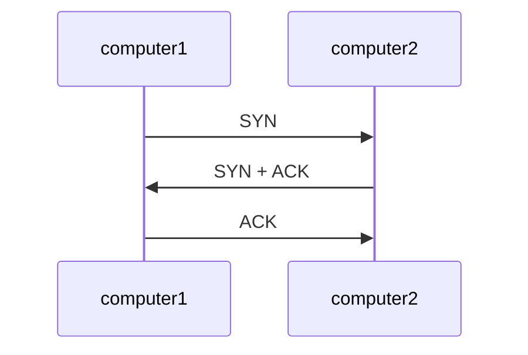
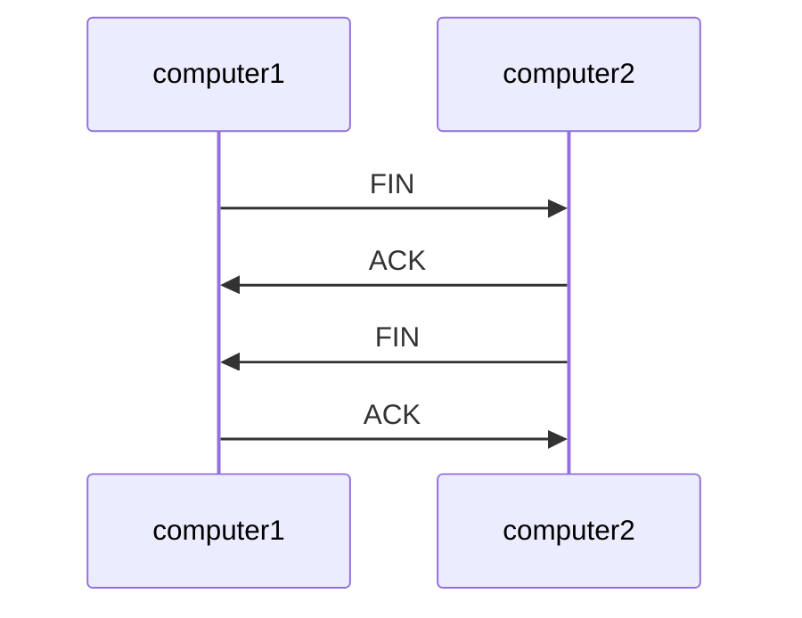
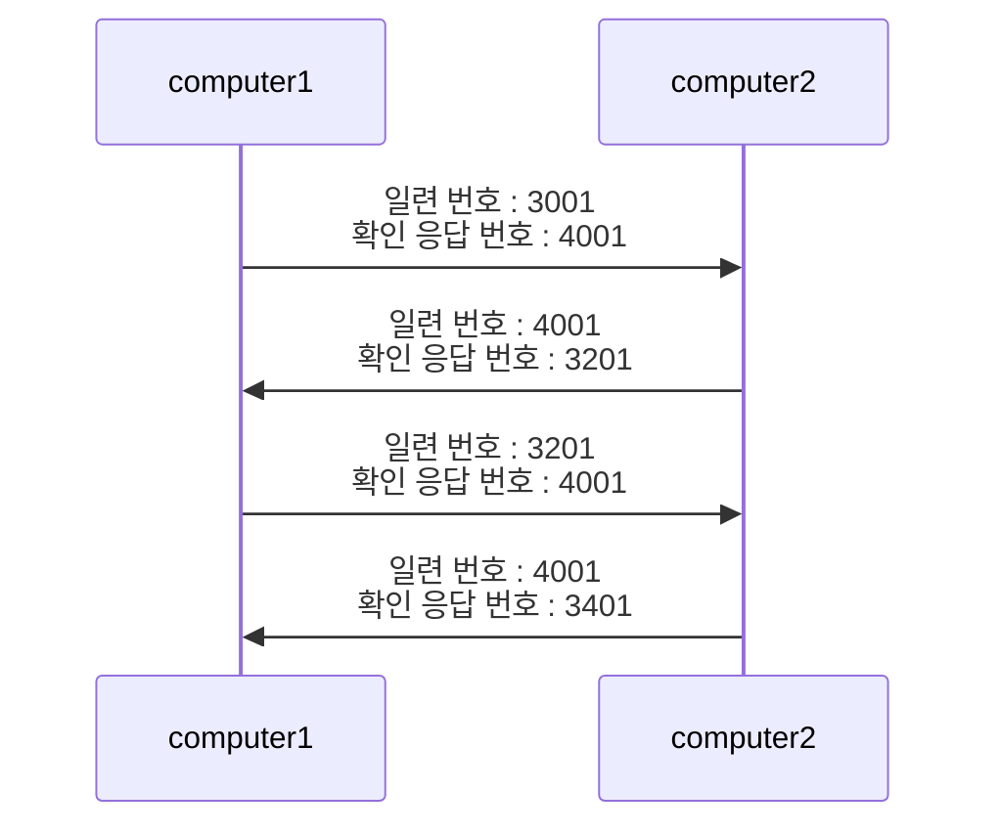

## 전송 계층
- 네트워크 계층에서 네트워크로 데이터를 전송에 라우터를 사용
    - 하지만 라우터만으로 목적지에 도착하지 못할 수 있음
- 전송 계층은 목적지에 신뢰할 수 있는 데이터를 전달하는 역할
    - 오류 점검과 전송된 데이터의 목적지 어플리케이션 식별

### 연결형 통신과 비연결형 통신
- 전송 계층에서는 신뢰성/정확성과 효율성의 특징을 가짐
- 연결형 통신 : 신뢰할 수 있고 정확한 데이터를 전달하는 통신
    - 연결마다 통신을 확인하는 작업 시행
- 비연결형 통신 : 효율적으로 데이터를 전당하는 통신
    - 확인 절차 없이 통신
- 전송계층에서 연결형 통신 프로토콜로 TCP, 비연결형 통신 프로토콜로 UDP 사용

### TCP
- 데이터 송신 측에서 응용 계층, 전송 계층, 네트워크 계층, 데이터 링크 계층, 물리 계층 순서로 캡슐화
    - 응용 계층에서 데이터를, 그리고 나머지 계층에서 헤더를 붙임
- 반대로 물리 계층부터 응용 계층으로 역캡슐화
    - 각 계층에서 헤더를 제거
- TCP헤더는 출발지 포트 번호, 목적지 포트 번호 등 11가지 정보로 이루어지고, TCP헤더가 붙은 데이터를 세그먼트라 부름
- 연결형 통신에서 연결(connection)이라는 가상의 독점 통신로를 확보한 후 데이터를 전송
    - TCP헤더에서 코드 비트는 6비트(URG, ACK, PSH, RST, SYN, FIN)으로 이루어져있고, 연결을 확립하기 위해 SYN, ACK값이 필요함

#### 3-way 핸드계이크

- 연결에서 SYN, ACK를 사용하여 연결 확립하여 데이터 전송을 하기 전 세 번의 통신을 함
    - 통신을 하고자 하는 컴퓨터에서 연결 확립 요청(SYN)을 보냄
    - 응답을 회신한 후 응답 확립 응답(ACK)과 응답 확립 요청(SYN)을 보냄
    - 최종적으로 연결 확립 응답(ACK)를 보냄

- 연결을 종료 할 때 FIN 과 ACK를 활용
    - 연결 종료 요청(FIN)을 보냄
    - 연결 종료 요청에 대한 연결 종료 응답(ACK)를 보냄
    - 추가적으로 연결 종료 요청(FIN)을 보냄
    - 마지막으로 연결 종료 응답(ACK)반환

#### 일련번호와 확인 응답 번호
- TCP 헤더의 일련 번호(sequence number)는 송신 측에서 수신 측에 몇 번째 데이터인지 알려주는 역할
- TCP 헤더의 확인 응답 번호(acknowledgement number)는 수신 측이 몇 번째 데이터를 수신했는지 송신 층에 알려주는 역할
    - 다음 데이터를 요청하는 역할을 함

- 3-way 핸드셰이크 연결 수립이 이루어 질 때, 일련번호 3001, 확인 응단 번호 4001이 결정
    - 처음 200바이트 데이터를 전송
    - 200 바이트 데이터를 수신하고, 다음 수신하고자 하는 데이터를 확인 응답 번호에 넣음
    - 수신측에서 요청한 3201번부터 데이터를 송신
- 데이터가 항상 올바르게 전송되는 것은 아니므로, 일련 변호, 확인 응답 번호를 사용해서 데이터가 손상되거나 유실된 경우 데이터를 재전송
    - 재전송 제어라고 부름

#### 윈도우 크기
- 각 세그먼트의 전송에서 데이터를 확인 및 응답하는 과정이 이루어짐
    - 각 전송마다 응답을 반환하는 방식은 효율이 높지 않음
    - 받은 세그먼트를 임시 저장하는 버퍼가 있지만, 대량의 데이터가 전송되면 보관되지 못하는 오버플로 발생
    - 오버플로가 발생하지 않도록 TCP 헤더의 윈도우 크기에 버퍼의 한계 크기를 알려줌

#### 포트 번호
- 전송 계층은 정확하게 데이터를 전달하는 역할뿐만 아니라, 목적지 애플리케이션 구분의 역할이 있음
- TCP헤더의 출발지 포트 번호, 목적지 포트번호를 활용
    - 포트 번호는 0~65535번을 사용
    - 0~1023은 잘 알려진 포트(well-known ports)로, 주요 프로토콜이 사용하도록 예약
        - SSH는 22, SMTP는 25, DNS는 53, HTTP는 80, POP3는 110, HTTPS는 443 등
    - 1024는 예약 되어 있지만 잘 사용하지 않고, 1025번 이상의 포트를 활용하여 송수신

### UDP
- 비연결형 통신이므로 연결을 확인하는 작업을 일일이 하지 않음
- UDP에서는 UDP헤더가 붙은 데이터를 UDP 데이터그램이라고 부름
    - UDP 헤더에는 출발지 포트 번호, 목적지 포트 번호, 길이, 체크섬으로 이루어짐
