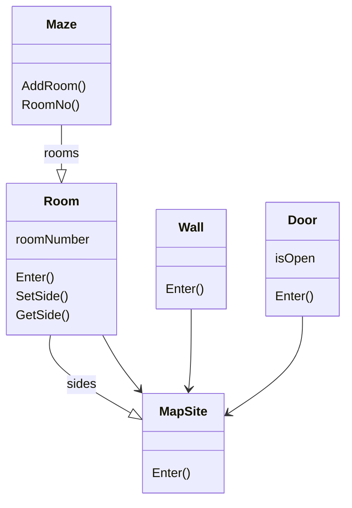

**tags**: #programming #design_pattern #GoF_design_pattern

## 생성 패턴

- [추상 팩토리(Abstract Factory)](추상%20팩토리.md)

- 생성 패턴은 인스턴스를 만드를 절차를 추상화하는 패턴
	- 객체를 생성, 합성하는 방법이나 객체의 표현방법과 시스템을 분리
	- 생성 패턴은 상송보다는 복합 방법을 사용하는 쪽으로 진화되어 가며 더 중요해짐
			- 고정된 행동 집합을 정의하는 것 보다, 더 복잡한 행동을 만드는 데 필요한 구성요소가 될 수 있는 기본적인 행동 집합을 정의하는데 더 많은 관심과 노력
	- 생성 패턴의 중요한 두가지
		- 생성 패턴은 시스템이 어떤 구체 클래스를 사용하는지에 대한 정보를 캡슐화
		- 생성 패턴은 이들 클래스의 인스턴스들이 어떻게 만들고 어떻게 서로 맞붙는지에 대한 부분을 완전히 가려줌
		- 결과적으로 어떻게 생성되고, 언제 생성할 것인지 결정에 유연성 확보 가능

## 생성 패턴 예시

